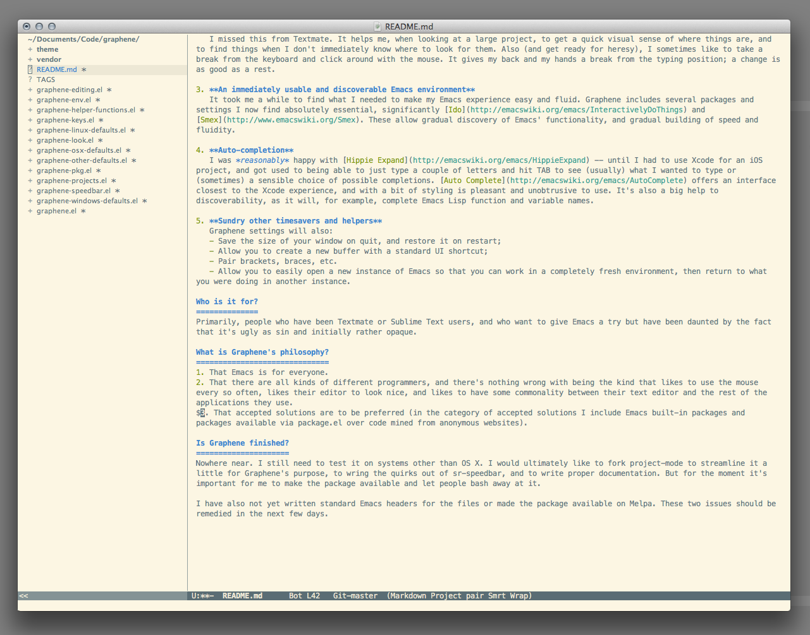

What is Graphene?
=================
It's a set of defaults for Emacs which should be friendly to users migrating from Textmate, Sublime Text or the like.

I don't pretend to be an Emacs expert -- I've only been using it for a year or so -- but I've found that after experiencing its capabilities I'm not able to go back to Textmate, and I'm reluctant to throw my lot in with another closed-source editor, for all sorts of reasons.

At the same time, neither base-level Emacs nor any of the defaults packages I've tried ([Prelude](https://github.com/bbatsov/prelude), [emacs-starter-kit](https://github.com/technomancy/emacs-starter-kit), etc.) have made Emacs work (and look) the way I want it to.

Graphene brings together what for me are the essentials. It is certainly opinionated, but still more liberal than I've found other similiar packages to be.

I should warn long-term Emacs users that some of what Graphene does may not be considered 'The Emacs Way'. I respond that the *whole point* of Emacs is its configurability, and I've laboured long and hard to make my Emacs an environment in which I'm comfortable. I have where possible made every effort to fit in with the standard Emacs ways of doing things, but where I don't like them, I've offered alternatives.

What does it include?
=====================
1. **A useful project mode**
   There are several project modes available for Emacs. All that I really want from such a mode, though, is to be able to easily load and switch among different projects without losing my place. For this reason, Graphene uses [Benjamin Cluff's project-mode](https://github.com/psyllo/emacsenations). This project-mode is the only one I've found which nicely implements project creation, loading and saving. Around these management functions I've implemented some hooks, to allow, for example, a project's desktop to be loaded and saved in tandem with the project.
   
2. **An attractive and functional project drawer**
   I missed this from Textmate. It helps me, when looking at a large project, to get a quick visual sense of where things are, and to find things when I don't immediately know where to look for them. Also (and get ready for heresy), I sometimes like to take a break from the keyboard and click around with the mouse. It gives my back and my hands a break from the typing position; a change is as good as a rest.
   
3. **An immediately usable and discoverable Emacs environment**
   It took me a while to find what I needed to make my Emacs experience easy and fluid. Graphene includes several packages and settings I now find absolutely essential, significantly [Ido](http://emacswiki.org/emacs/InteractivelyDoThings) and [Smex](http://www.emacswiki.org/Smex). These allow gradual discovery of Emacs' functionality, and gradual building of speed and fluidity.
   
4. **Auto-completion**
   I was *reasonably* happy with [Hippie Expand](http://emacswiki.org/emacs/HippieExpand) -- until I had to use Xcode for an iOS project, and got used to being able to just type a couple of letters and hit TAB to see (usually) what I wanted to type or (sometimes) a sensible choice of possible completions. [Auto Complete](http://emacswiki.org/emacs/AutoComplete) offers an interface closest to the Xcode experience, and with a bit of styling is pleasant and unobtrusive to use. It's also a big help to discoverability, as it will, for example, complete Emacs Lisp function and variable names.
   
5. **Sundry other timesavers and helpers**
   Graphene settings will also:
   - Save the size of your window on quit, and restore it on restart;
   - Allow you to create a new buffer with a standard UI shortcut;
   - Pair brackets, braces, etc.
   - Allow you to easily open a new instance of Emacs so that you can work in a completely fresh environment, then return to what you were doing in another instance.

Who is it for?
==============
Primarily, people who have been Textmate or Sublime Text users, and who want to give Emacs a try but have been daunted by the fact that it's ugly as sin and initially rather opaque.

What is Graphene's philosophy?
==============================
1. That Emacs is for everyone.
2. That there are all kinds of different programmers, and there's nothing wrong with being the kind that likes to use the mouse every so often, likes their editor to look nice, and likes to have some commonality between their text editor and the rest of the applications they use.
$3. That accepted solutions are to be preferred (in the category of accepted solutions I include Emacs built-in packages and packages available via package.el over code mined from anonymous websites).

Is Graphene finished?
=====================
Nowhere near. I still need to test it on systems other than OS X. I would ultimately like to fork project-mode to streamline it a little for Graphene's purpose, to wring the quirks out of sr-speedbar, and to write proper documentation. But for the moment it's important for me to make the package available and let people bash away at it.

I have also not yet written standard Emacs headers for the files or made the package available on Melpa. These two issues should be remedied in the next few days.

